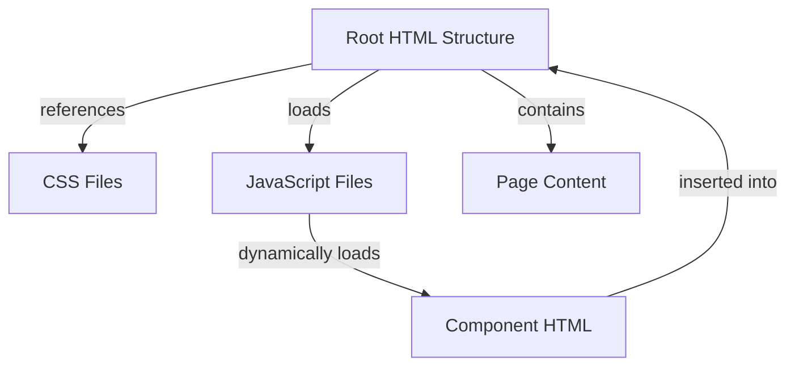
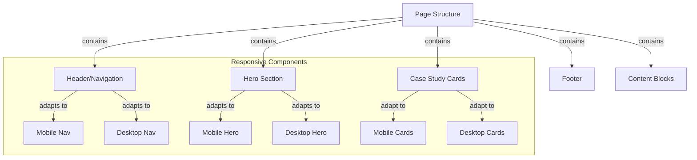
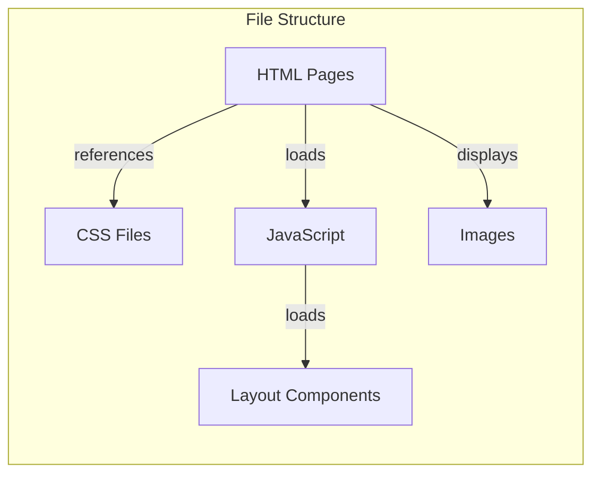

# System Patterns - Gabe Velez Portfolio Website

## Architecture Overview

The Gabe Velez portfolio website follows a component-based architecture with minimalist implementation. Its structure emphasizes simplicity, performance, and maintainability without relying on frameworks.



## Key Design Patterns

### 1. Component Loading Pattern
The site uses jQuery to dynamically load header and footer components instead of duplicating them across pages:

```javascript
// Dynamic component loading in layout.js
$(function() {
    if ($("body").hasClass("home")) {
        $("header").load("/layout/nav_index.html");
    } else {
        $("header").load("/layout/nav.html");
    }
    $("footer").load("/layout/footer.html");
});
```

This pattern:
- Maintains consistent navigation/footer across the site
- Reduces duplication and maintenance overhead
- Allows page-specific header variations (home vs. other pages)

### 2. Responsive Design Architecture

The site follows a mobile-first responsive design pattern with three primary breakpoints:
- Base styles (mobile): < 600px
- Mid-range (tablet): 600px - 1059px 
- Desktop: ≥ 1060px

Media queries in the CSS cascade styles from mobile (default) up to larger screens:

```css
/* Base styles for mobile */
.element {
    /* Mobile-first default styles */
}

/* Tablet breakpoint */
@media (min-width: 600px) {
    .element {
        /* Tablet-specific modifications */
    }
}

/* Desktop breakpoint */
@media (min-width: 1060px) {
    .element {
        /* Desktop-specific modifications */
    }
}
```

### 3. CSS Custom Properties (Variables) Pattern

Custom properties define a consistent color system:

```css
:root {
  --gabe-black: #1B2021;
  --gabe-black-alpha: rgb(27 32 33 / 85%);
  --gabe-white: #FFFFFF;
  --gabe-gray: #364042;
  --gabe-red: #800020;
  --gabe-darkred: #240000;
  --gabe-teal: #235965;
  --gabe-gold: #e9c35c;
}
```

This enables:
- Consistent color application
- Single-point color modification
- Semantic color naming

### 4. Adaptive Navigation Pattern

The navigation adapts between:
- Mobile: Hamburger menu with fullscreen overlay
- Desktop: Horizontal navigation bar

This is controlled through CSS media queries and the checkbox-based toggle pattern for mobile:

```html
<input id="menu__toggle" type="checkbox" />
<label class="menu__btn" for="menu__toggle">
    <span></span>
</label>
```

### 5. Card Component Pattern

Case studies use a consistent card pattern for display:

```html
<a class="card" href="case-studies/example.html">
    <picture>
        <!-- Responsive image sources -->
    </picture>
    <div class="card__textarea">
        <h3 class="card__title">...</h3>
        <p class="card__description">...</p>
    </div>
</a>
```

This pattern:
- Creates visual consistency
- Encapsulates related content
- Facilitates responsive layout adaptation

### 6. Responsive Image Strategy

The site uses the `<picture>` element pattern for responsive, optimized images:

```html
<picture>
    <source type="image/webp" media="(min-width: 1060px)" 
            srcset="img/image.webp 1x, img/image@2x.webp 2x" />
    <source type="image/webp" media="(min-width: 600px)" 
            srcset="img/image-tablet.webp" />
    
</picture>
```

This enables:
- Device-appropriate image sizing
- WebP format usage with fallbacks
- Resolution-specific images (1x/2x)
- Performance optimization via lazy loading

### 7. Block-Based Content Pattern

Case studies use a block-based content structure:

```html
<section class="block block__teal">
    <div class="block__container">
        <h3 class="block__title">Section Title</h3>
        <p>Content...</p>
    </div>
</section>
```

This creates:
- Visual separation between content sections
- Consistent spacing and layout
- Themed sections (using color variations)

## Component Relationships



## State Management

The site uses minimal state management:
- Menu toggle state for mobile navigation
- Scroll position detection for header appearance
- No complex application state

Example of scroll-based state management:
```javascript
$(window).on("scroll", function() {
    if($(window).scrollTop() > 10) {
        $(".logo__gabe").removeClass("logo__gabe--remove");
    } else {
        $(".logo__gabe").addClass("logo__gabe--remove");
    }
});
```

## Code Organization



- HTML: Page templates with minimal content
- CSS: Single style.css with all styles
- JS: Minimal JavaScript for component loading and interactions
- Layout components: Reusable header/footer templates
- Images: Optimized for web with responsive variants
